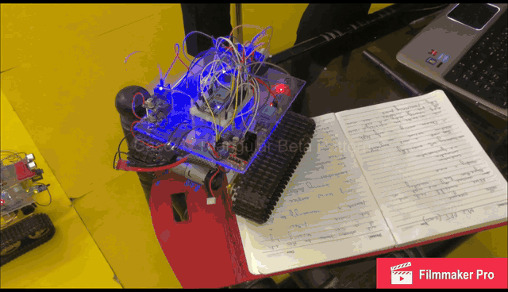
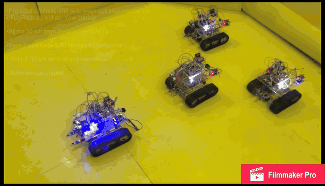
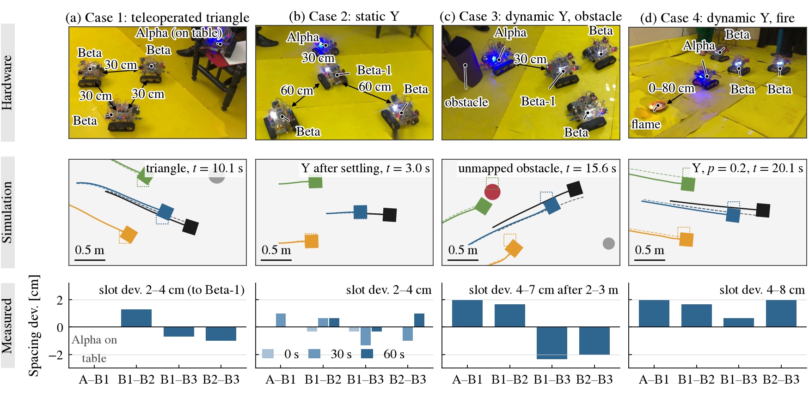

# Swarm Autobots
## Video: https://youtu.be/-lVYkj_FrYI

**Pattern Formation Control for Robot Teams**

<p align="center">
  <a href="https://youtu.be/-lVYkj_FrYI"></a>
  <a href="https://youtu.be/-lVYkj_FrYI"></a>
</p>

Four tracked robots, each with a single ESP32, encoders, a magnetometer, one
ultrasonic and two infrared rangers, hold triangle and Y formations while
talking only over unacknowledged ESP-NOW broadcast. Every robot runs the same
code. Roles come from a heartbeat election, so any robot can take over as
leader and the swarm can switch patterns on command.

This repository contains the simulator and the swarm algorithms, all
experiment scripts with their raw results, the figure scripts, the ESP32
firmware agent, and the ROS 2 middleware packages.

## Method

| Component | Idea | Where |
|---|---|---|
| Leader prediction | Followers propagate the last leader packet along a constant-twist arc, so slot error grows as O(τ²) in packet age instead of O(τ) | `sim/core.py: predict_leader` |
| Look-ahead tracking | Feedback-linearized control of a point 0.1 m ahead of each follower | `sim/core.py: lpsi_control` |
| Pacing and planning | The leader slows down when a follower reports a large error; A* inflates obstacles by the formation half-width | `sim/core.py: astar_path`, `SwarmSim` |
| Range-based speed filter | Closed-form sampled-data bound on raw range readings: `v <= λh / (T cos β)` | `sim/core.py: cbf_filter` |
| Deadlock recovery | Rotate toward the slot side, then advance, when the filter blocks a follower | `sim/core.py: control_step` |
| Heartbeat election | Bully-style election ordered by MAC address; the leader's state frame is the heartbeat | `sim/core.py`, `ros2_ws/.../agent.py` |
| Slot persistence | After a leader change, robots keep their slots relative to the new leader's slot | same |
| Pattern switching | Pattern ID carried in the heartbeat | same |

## Main results

Hardware (2.4 × 2.4 m arena; trials that held the pattern, and ground-truth
measurements of the swarm layer on the floor grid):

| Case | Original firmware (ASA) | Swarm layer | Largest spacing error | Slot deviation |
|---|---|---|---|---|
| 1 Triangle (teleoperated) | 5/5 | 3/3 | 1.3 cm | 2–4 cm |
| 2 Static Y (60 s hold) | 5/5 | 3/3 | 1.3 cm | 2–4 cm |
| 3 Dynamic Y with obstacle | 5/5 | 3/3 | 2.3 cm | 4–7 cm |
| 4 Dynamic Y + fire mission | 5/5 | 3/3 | 2.0 cm | 4–8 cm |
| 5 Leader failure (Alpha switched off) | n/a | 3/4 | takeover 1.7–1.8 s | |
| 6 Pattern switch | n/a | 3/3 | switch 1.5–2.0 s | |

Repeated runs agreed within about ±5 cm. The flame sensor triggers up to
80 cm; the fire was put out in 8.4 s with 55 ml of water.



Simulation (26,160 missions with ground truth):

* The predictor cuts controller-level slot error by 41% (triangle) and 36% (Y) at 60% packet loss compared with a zero-order hold.
* Under loss the swarm degrades less than a consensus baseline (Ren 2007) that sends 2.5 to 4.2 times more radio traffic: 0.170 m vs 0.191 m ground-truth RMSE at 60% loss (triangle).
* With unmapped obstacles and a conservative 0.142 m footprint (it encloses the 20 cm square chassis), the safety layer keeps 76-93% of missions contact-free, against 0-7% without it; deadlock recovery raises success from 2% to 55%. Remaining contacts are side contacts in the blind sectors between the range rays.
* Recovery after leader loss takes 1.65 s (no loss) to 1.95 s (60% loss); pattern switches take 1.40 to 1.69 s.
* Every open-arena mission with up to 20 robots completes.
* Ablation: removing any component worsens at least one measured outcome; the speed filter and recovery matter most for completion.
* Constant-twist prediction error grows as τ^1.92 against τ^1.00 for a zero-order hold, as predicted.
* Calibration: the simulator reproduces the hardware errors with a compass-bias spread of 0.25–0.5° and
  at most 1–2% slip, so the datasheet-based nominal model is conservative.
* Dead-reckoning drift (about 3% of distance) dominates ground-truth error. A model-mismatch study shows the
  conclusions hold under wider slip, double motor lag and triple sensor noise, and that compass bias is what limits
  ground truth: 0.11 m slot error and 100% success at 1 degree of bias, about 0.5 m at 6 degrees.

Implementation checks:

* `firmware/swarm_agent/SwarmAgent.h`: C++ port of the agent, identical to the Python agent, with prediction and in ZOH mode,
  over 15,716 closed-loop steps (differences below 1e-13), cross-compiles for the ESP32 in 5.9 kB code and 4.8 kB RAM.
* `tools/`: overhead-camera ArUco ground truth for hardware trials (self-test: 0.5 mm mean error), see
  [docs/hardware_evaluation.md](docs/hardware_evaluation.md).
* `.github/workflows/ci.yml`: configured to run all tests and to build and launch the ROS 2 packages on ROS 2 Jazzy on every push (see the Actions tab).

## Repository layout

```
sim/                 simulator, swarm algorithms, experiments, figure scripts
  core.py            robot, sensor and ESP-NOW channel models + all controllers
  runner.py          batched missions and metrics against ground truth
  experiments.py     main experiments (E1 to E7)
  e9_review.py       component ablation, prediction-bound check
  e12_calib.py       compass-bias and slip calibration against hardware
  make_sim_videos.py labelled simulation videos
  make_cases_fig.py  hardware / simulation / measured figure of the four cases
  sensitivity.py     election timeout and speed-filter rate sweeps
  make_figs.py       all result figures + results/stats.json
  make_robot_fig.py  robot photo and sensor layout figure
  make_teaser.py     robots and leader-recovery figure
  results/           raw results (JSON)
  figs/, figs_hw/    generated figures, hardware photos
ros2_ws/src/         ROS 2 packages (middleware layer)
  swarm_autobots_msgs/  LeaderState (20 B frame), FollowerStatus (4 B), Ranges
  swarm_autobots/       portable agent, ROS 2 nodes, launch file, tests
firmware/            C++ swarm agent for the ESP32, equivalence test, ESP-NOW loss test
tools/               overhead-camera ground truth (ArUco) and hardware metrics
docs/                architecture, reproduction guide, hardware, ROS 2 notes
media/               demo GIFs, teaser and CAD renders
```

## Quick start

```bash
git clone https://github.com/Maaz-qureshi98/Swarm-Autobots.git
cd Swarm-Autobots
pip install -r requirements.txt

# redraw every figure from the stored results (seconds)
make figs
```

To rerun the experiments from scratch (about 30 to 60 minutes on two cores):

```bash
make experiments    # writes sim/results/*.json
make figs
```

Details, including which script produces which table and figure, are in
[docs/reproduce.md](docs/reproduce.md).

## ROS 2

```bash
cd ros2_ws && colcon build && source install/setup.bash
ros2 launch swarm_autobots swarm_sim.launch.py num_robots:=4 formation:=Y loss:=0.2
ros2 topic pub --once /swarm/formation_cmd std_msgs/String "data: triangle"
```

The agent (`swarm_autobots/agent.py`) has no ROS dependency, so the same logic
runs in a ROS 2 node, in the tests, and in a C port on the ESP32. See
[docs/ros2.md](docs/ros2.md). The tests run without ROS:

```bash
python3 ros2_ws/src/swarm_autobots/test/test_agent_closed_loop.py
python3 ros2_ws/src/swarm_autobots/test/test_ros_graph.py
```

## Hardware

T101 tracked chassis (20 × 20 cm), two GM25-370 Hall-encoder motors, L298N
driver, 38-pin ESP32, HC-SR04 ultrasonic, two Sharp 2Y0A21 IR rangers, GY-271
magnetometer, flame sensor with relay and 5 V pump, 12 V 4200 mAh LiPo (motor driver fed directly, 5 V logic from two LM2596 buck converters in parallel). Robot
mass 1.26 kg, or 1.65 kg with a full 350 ml tank. Bill of materials and wiring
notes are in [docs/hardware.md](docs/hardware.md).

## License

Code is released under the MIT License (see [LICENSE](LICENSE)). Photos and CAD
renders are © the authors.
